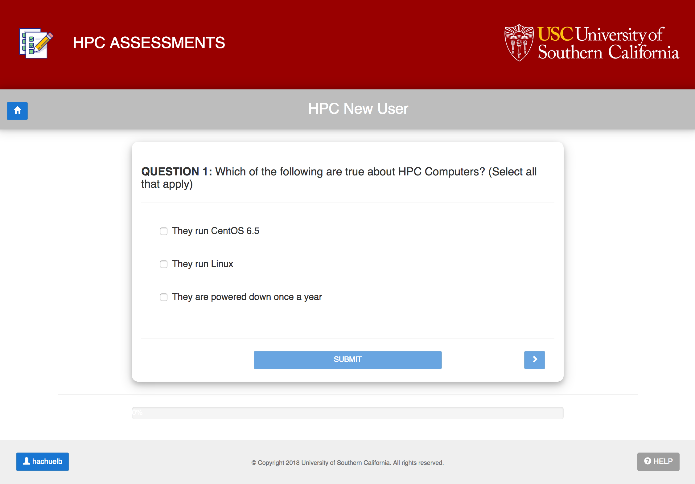
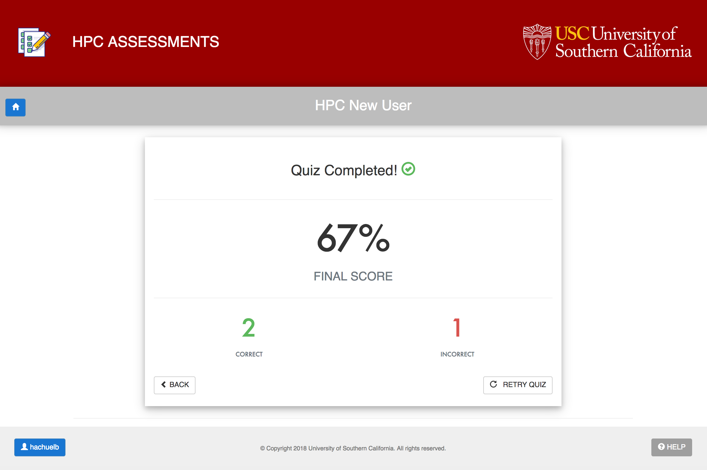
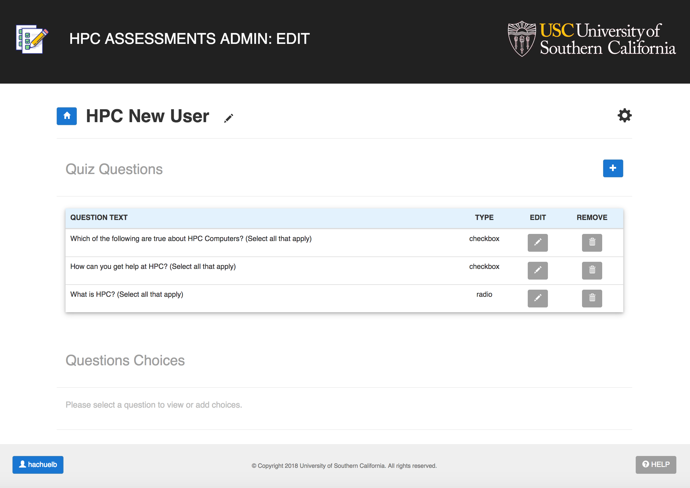

# HPC Quiz Maker

The **HPC Quiz Maker** is a fully-functional, modular web application built with PHP, MySQL, and responsive web design frameworks with the ultimate goal of enabling instructors to easily build and deploy user assessments as needed. 

The tool was built  for the Center for [High-Performance Computing](http://hpcc.usc.edu/) (HPC) at the [University of Southern California](https://www.usc.edu/), a global leader in research computing.

## How it Works

<u>The site includes the following components:</u>

### 1) Main User Dashboard

The main user dashboard serves as the main page for the user. It allows the user to **select from a list of available or in-progress quizzes** to complete, or **view personal statistics** on previously completed assessments. *Below are some sample snapshots of elements within the main user dashboard.*

The user may look at a full history of completed quizzes and statistics through the "**SEE MORE**" button located in the *'completed quizzes' card*. As shown, users may take a particular quiz as many times as they deem it necessary.

### 2) Quiz Page

Once a user selects a quiz from the list of available or in-progress assessments, a redirection occurs to the main quiz page. **This page includes all questions for the selected quiz, shown one at a time** (and must be completed in order). 

**When a user submits an answer**, these get <u>immediately submitted to the mySQL database</u> through Ajax calls (one answer at a time). This allows the user to come back at a later time to complete the quiz if necessary. It also allows the user to **see the answer details** to a particular question (after they submit), rather than having to wait until the end of the quiz. 

When the user completes the quiz, **the final statistics card is show**. At this point, once the user goes back to the home page, it will not be possible to return to this particular quiz, as it is no longer in progress. 

The user is, however, able to take the quiz again *(as mentioned in a prior note, users may take the same quiz as many times as desired, and each instance will be saved in the database)*. Below is a sample final statistics card (for a 2-question quiz).

### 3) Main Admin Dashboard 

The main admin dashboard **allows instructors to manage the assessments content**. That includes:

* **a) creating** new quizzes

* **b) editing** existing quizzes

* **c) viewing statistics** from completed and in-progress user assessments (only certain admin users may click on this link)

  ​

#### A) Create a New Quiz

Admin users may create new quizzes by clicking on the 'CREATE NEW QUIZ' button on the admin dashboard. This will prompt the user to **populate the quiz name and its short description** (required fields). User may then proceed to edit the quiz.

#### B) Edit New or Existing Quiz

Admin users may edit an existing quiz by clicking on the 'EDIT EXISTING QUIZ' button and selecting the desired quiz from the shown list. This will **redirect the user to the main edit page for the selected quiz**:

This page allows the user to add (questions, and question choices), edit, or delete items, as well as configuring advanced settings and deploying the quiz (show it active to users) once it is ready.

#### C) Statistics Dashboard

*(in development)*